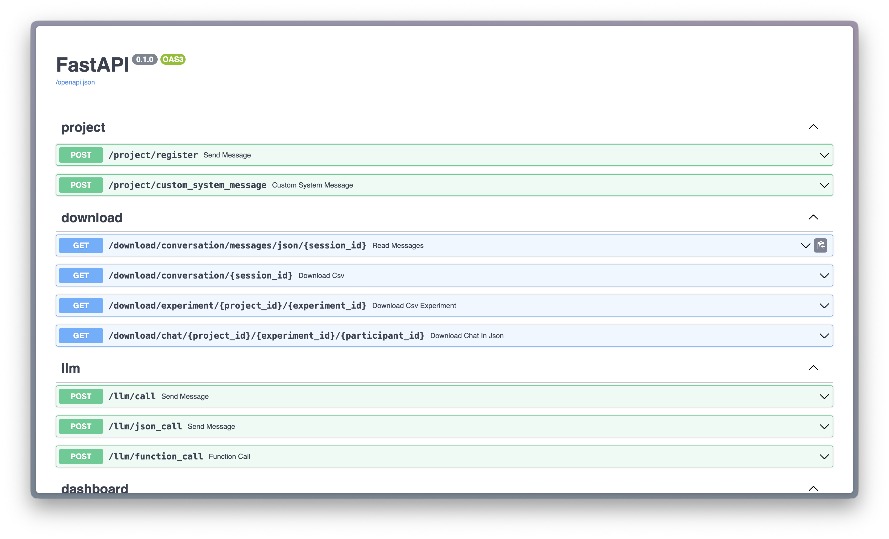
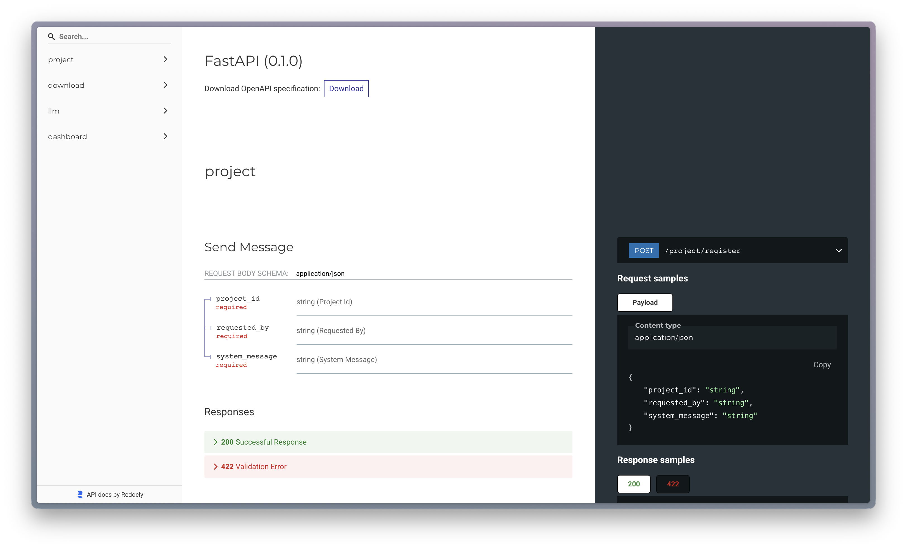
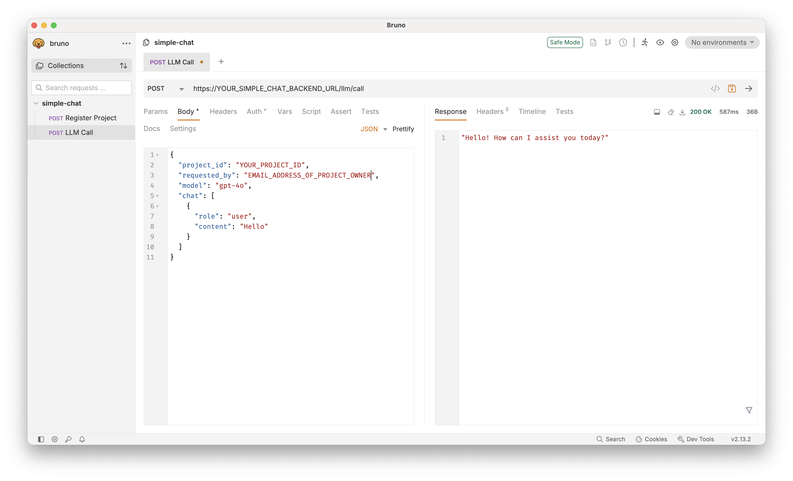

# Backend

The backend is built with [FastAPI](https://fastapi.tiangolo.com/).
To show an interactive API documentation of a deployed Simple Chat backend, visit:

- `https://YOUR_SIMPLE_CHAT_BACKEND_URL/docs` - [Swagger UI](https://swagger.io/tools/swagger-ui/)-version of the API documentation. It is interactive and allows testing the endpoints.

    <!-- markdownlint-disable MD033 -->
    <div align="center">

    

    </div>
    <!-- markdownlint-enable MD033 -->

- `https://YOUR_SIMPLE_CHAT_BACKEND_URL/redoc` - [Redoc](https://github.com/Redocly/redoc)-version of the API documentation

    <!-- markdownlint-disable MD033 -->
    <div align="center">

    

    </div>
    <!-- markdownlint-enable MD033 -->

where `YOUR_SIMPLE_CHAT_BACKEND_URL` is a placeholder for your actual Simple Chat backend URL.

The documentation below includes sample requests to the backend with [`curl`](https://en.wikipedia.org/wiki/CURL). We recommend using [Bruno](https://www.usebruno.com/) to test the endpoints in a user-friendly interface.

<!-- markdownlint-disable MD033 -->

<div align="center">



</div>
<!-- markdownlint-enable MD033 -->

## Register Project

Every conversation should be assigned to a project. Project must be registered in advance.

To register a new project this endpoint by the proper body should be called as:

```shell
curl --request POST \
  --url https://YOUR_SIMPLE_CHAT_BACKEND_URL/project/register \
  --header 'content-type: application/json' \
  --data '{
  "project_id": "MY_PROJECT_ID",
  "requested_by": "MYEMAIL",
  "system_message": "You are a helpful assistant.",
}'
```

In the example above, `YOUR_SIMPLE_CHAT_BACKEND_URL` is a placeholder for your actual Simple Chat backend URL.

The `requested_by` should be the email address of who submit the request.

The `project_id` should be defined by who submit the request. If this `project_id` is the same as another project, the system will give you an error.

Since every conversation must be assigned to a project, the `project_id` should be set as a query param to like this `YOUR_SIMPLE_CHAT_FRONTEND_URL/?pid=`.

## Custom system_message and Assistant First

In case you need to change the system_message for every chat in the same project, automatically by code, you can send the custom system_message to the URL below. In the following example, `YOUR_SIMPLE_CHAT_BACKEND_URL` is a placeholder for your actual Simple Chat backend URL.

```shell
curl --request POST \
  --url https://YOUR_SIMPLE_CHAT_BACKEND_URL/project/custom_system_message \
  --header 'content-type: application/json' \
  --data '{
  "system_message": "You are a helpful assistant.",
}'
```

```json
{
  "project_id": "str",
  "requested_by": "str",
  "system_message": "str",
  "assistant_first": "bool"
}
```

A successful response should be like:

```json
{
  "status": true,
  "system_message_id": "...."
}
```

You will save the `system_message_id` and later when you want to create the Simple Chat window you will pass it as a query parameter, like this `&system_message_id=`.

If you set the assistant_first equal to true, as soon as the Simple Chat window is opened, the assistant starts to write the response it created based on `system_message`. If you set it equal to false then it will be like normal chat and start with the first message from the user.

## Download a chat

The chat of a conversation can be downloaded by calling this endpoint, after replacing the placeholders in the URL below. In the following example, `YOUR_SIMPLE_CHAT_BACKEND_URL` is a placeholder for your actual Simple Chat backend URL. Placeholders `[pid]`, `[experiment_id]`, and `[participant_id]` must be replaced with true values.

```shell
curl --request GET \
  --url https://YOUR_SIMPLE_CHAT_BACKEND_URL/download/chat/[pid]/[experiment_id]/[participant_id]
```

The result should be an object like this:

```json
{
  "document_id": "<document_id>",
  "conversation_id": "<conversation_id>",
  "chat": [
    {
      "role": "<role>",
      "content": "<string>"
    }
  ]
}
```

## Call an LLM directly

The endpoint below is developed to call an LLM directly and return the response.

```shell
curl --request POST \
  --url https://YOUR_SIMPLE_CHAT_BACKEND_URL/llm/call \
  --header 'content-type: application/json' \
  --data '{
    "project_id": "[project_id]",
    "requested_by": "[email address of project owner]",
    "model": "[model]",
    "chat": [
      {
        "role": "user",
        "content": "Hello"
      }
    ]
  }'
```

The response will be a string like:

> "Hello! How can I assist you today?"

## Model Aliases

It is possible to define aliases in the backend for certain models in [`socket_setup.py`](../backend/src/routes/socket_setup.py). This may be desirable if the model name is either too long or it contains characters that are undesirable in a URL, like slash (`/`). For example:

- `deepseekr1` as alias for `together_ai-deepseek-ai/DeepSeek-R1`
- `Llama-3.3-70B-Instruct-Turbo` as alias for `together_ai-meta-llama/Llama-3.3-70B-Instruct-Turbo`

## System Message and Assistant First

Although a default system message is initially defined in the `system_message` field for each project, you can create a customized system message by adding query params `&system_message_id=` at the end of the URL when opening a new iframe to start the conversation with the new system message.

The `assistant_first` attribute, when set to true, causes the first message in the conversation to be given by the LLM, instead of the user, based on the system message. Set it to `false` to let the user send the first message to start a conversation.

In the following example, `YOUR_SIMPLE_CHAT_BACKEND_URL` is a placeholder for your actual Simple Chat backend URL.

```shell
curl --request POST \
  --url https://YOUR_SIMPLE_CHAT_BACKEND_URL/project/custom_system_message \
  --header 'content-type: application/json' \
  --data '{
    "project_id" : str,
    "requested_by" : str,
    "system_message": str,
    "assistant_first": bool,
    "first_message": str
}'
```

If you want to have a static message as the first message to be sent to user, write your message in the `first_message`, otherwise leave it empty, then the first message will be `assistant` generated by LLM call, if `assistant_first` is true.

Successful response should be like:

```json
{
  "status": true,
  "system_message_id": "...."
}
```

## Multi-Round Conversation

If you need a conversation to be carried out in multiple sections but the conversation history remains in the subsequent sections, you can add `&round=` in the url as a query parameter. Zero is not accepted and the numbers must be increased in sequential order (e.g., 1, 2, 3, 4, 5,...).

When creating a new conversation, the system automatically places the previous conversation messages at the beginning of the new conversation messages.

**Note:** This option overrides `custom message`.

## Restrict Email Domains

To restrict user registration to specific email domains, search in the codebase for the string `@mydomain.com` and replace it with your desired domain, e.g., `example.com`. This change should be made in the following files:

- `dashboard/src/pages/LoginPage.jsx` (label for email input)
- `dashboard/src/contexts/AuthContext.jsx` (validation of email in local storage)
- `backend/src/routes/project.py` (validation of `requested_by` field)
