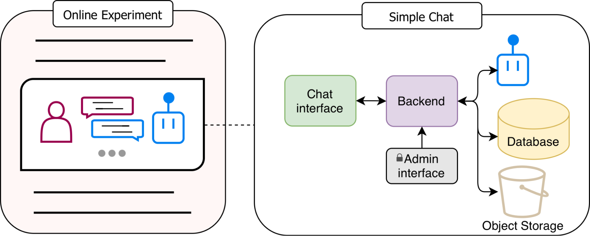
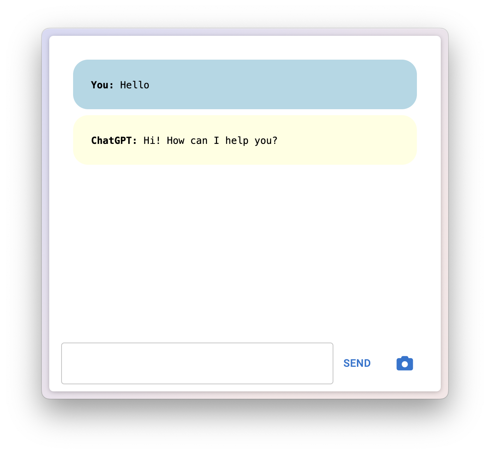

# Simple Chat

Simple Chat is a user-friendly web interface that facilitates and optimizes the integration of LLMs into online experiments. Simple Chat offers three core benefits:

1. An **embeddable chat interface** that eliminates the need for custom API coding,
1. a consistent interface **across survey platforms**, and
1. streaming responses that maintain conversational flow and reduce participant dropout.

Below are diagrams illustrating the architecture and chat interface:

<details><summary>Architecture</summary>
<p>

<!-- markdownlint-disable MD033 -->
<div align="center">

### Architecture <!-- markdownlint-disable-line MD001 -->



</p>
</details>

<details><summary>Chat interface</summary>
<p>

### Chat interface


</div>
<!-- markdownlint-enable MD033 -->

</p>
</details>

## Requirements

- Install [Docker](https://docs.docker.com/desktop/install/mac-install/) version `24.0.5, build ced0996` or newer
- Install [Docker Compose plugin](https://docs.docker.com/compose/install/linux/) version `v2.20.2-desktop.1` or newer
- Define secrets
  - Create `.env` file in the **backend** directory by copying the [`env.example`](./backend/env.example) file:

    ```bash
    cp backend/env.example backend/.env
    ```

    All variables defined in [`settings.py`](./backend/src/models/settings.py) must be set in the `.env` file.
    `AZURE_OPENAI_BASE_URL` and `AZURE_OPENAI_API_KEY` can be left empty if not using Azure OpenAI.

  - Create `.env` file in the **frontend** directory by copying the [`env.example`](./frontend/env.example) file:

    ```bash
    cp frontend/env.example frontend/.env
    ```

    The default values can be used for local development.

## Installation

- Refer to the [deployment](./docs/deployment.md) documentation for first-time installation.
- Refer to the [contributing](./contributing.md) documentation to set up a development environment for modifying the code.

## Usage

Refer to the [documentation](./docs/readme.md) folder for usage instructions.

## Related

- Qualtrics example - [Download](https://drive.google.com/file/d/1cPyH_bUEBzdn5NsDzJvVUe9QytTyvbj3/view?usp=sharing).

  This Qualtrics template is a modified version of [Costello's Qualtrics template](https://publish.obsidian.md/qualtrics-documentation/Documentation+for+Using+the+Human-AI+Interaction+Qualtrics+File/Human-AI+interaction+Qualtrics+template+documentation).

- oTree example - [simple-chat-otree-walter-2025](https://github.com/center-for-humans-and-machines/simple-chat-otree-walter-2025)
- Readme template - [minimal-readme](https://github.com/rodrigobdz/minimal-readme)
- Format for `script` directory - [Shell Style Guide](https://github.com/rodrigobdz/styleguide-sh)
- See `healthcheck` Docker Compose file - [docker-compose-healthchecks](https://github.com/rodrigobdz/docker-compose-healthchecks)

## License

[CC BY 4.0](license)
